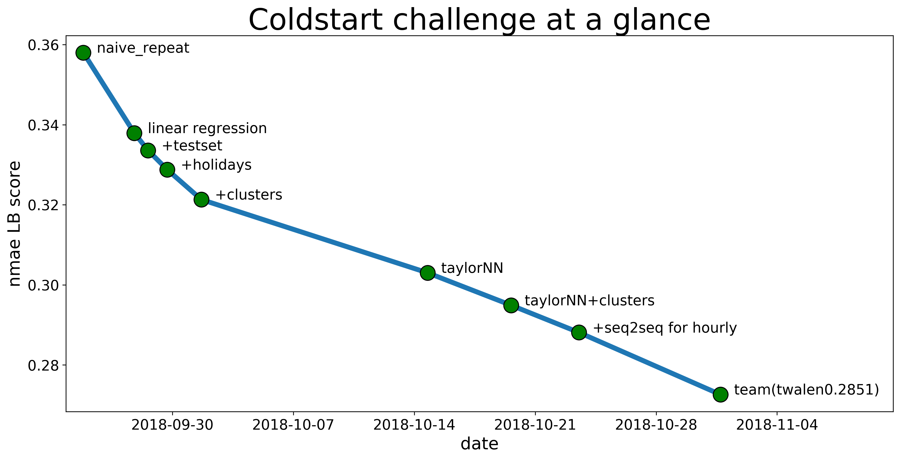
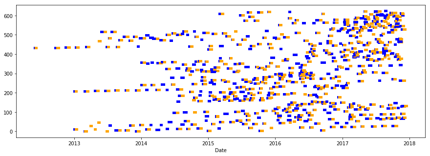
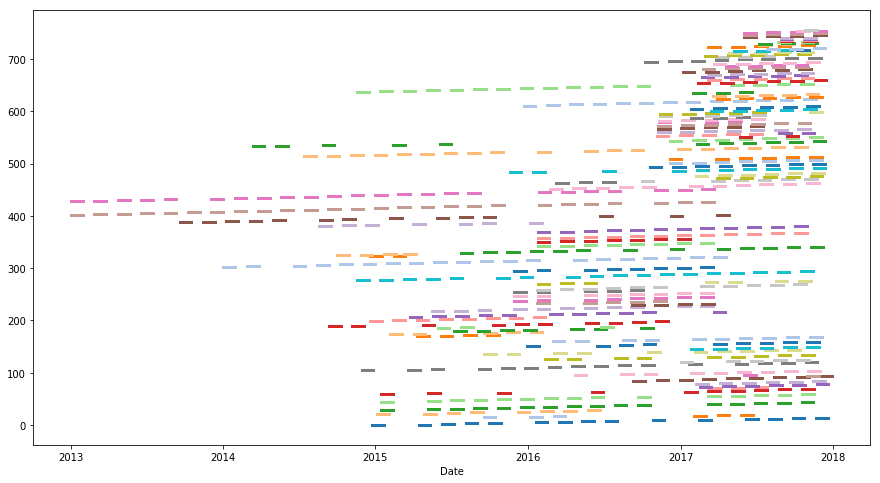
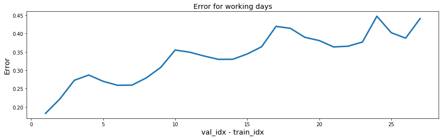
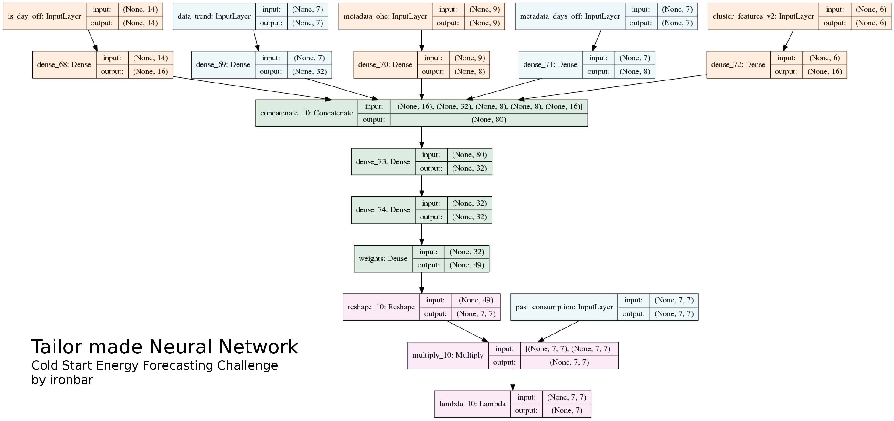

# Solution Summary
<!---https://www.kaggle.com/wiki/WinningModelDocumentationTemplate --->

## Solution summary at 12/10/2018

### Weighting past data to predict the future
After exploring the data I have found that the curves of consumption are quite complex, so instead of predicting them from scratch I think it's easier to weight the past data to predict the future. This is an hypothesis that may be wrong, but I'm currently on 2 position so it has some sense.

### Useful features

* `days off` There is a clear separation between working days and days off. At the start of the challenge this was my only feature and I was able to reach 3rd position using this feature and linear regression only. Using holidays was beneficial.
* `consumption trend` Sometimes there is a clear decrease or increase tendency in the consumption, so giving the trend as input helps to improve.
* `metadata` Encoding the size of the building and base temperature with one hot encoding also helps to make better predictions.
* `cluster_id` I have found that there are clusters of buildings on the data. It greatly improves the scores of hourly predictions. When merging with a normal prediction improves the LB score. I believe I'm not using in a correct way this information right now.

I have found that using more than 7 days of input data yields no benefit.

Also using temperature as input does not seem to improve. Probably because there are a lot of missing values.

### Models used

#### Linear regression
After trying with some naive approaches I started using linear regression. I trained many models, one for each combination of days off that the model had as input.

I found that fitting the models only on the clusters and merging those predictions with the originals improved the score. This is an evidence in favour of the cluster information.

The capacity of this approach was limited by the different combinations of days off. For example when having 1 day as input only 4 models were trained. This is why I moved to taylor made models. However I may think a way of changing this.

#### Taylor made model
This was an evolution of the linear regression that allowed to give more inputs to the model. When adding more inputs it has improved the scores, however at the same conditions the scores are worse. I believe it's probably because imbalanced data is more easily optimized with the linear regression separations. With taylor made model I train one single model whereas on linear regression I could train 100.

I have seen that using cluster_id as input greatly improves validation scores on hourly predictions.

I'm currently tryin to improve the architecture.

### Ways to improve

* Once I have finished with architecture optimization check the errors and see if there is a way to solve them
* Deeper exploration of the clusters. Can I find a better representation? Can I reduce the number of clusters? Can I make my own clusters? I should try to find features that allow to improve the score as much as ohe but with a better representation that allows to better generalize on the test set.
* Is there a better way to model the problem? Make drawings understanding what the model is doing and think of alternatives.
* Literature. Read about the topic and search for inspiration.

## Final solution

### The challenge at a glance

### Schema of the solution description

1. Challenge description. What we have to predict, which data do we have, metric
2. Data exploration. Which are the main insigths of the data.  Clusters. Randomness
3. First steps with linear regression
4. Taylor-made NN. A good drawing will be very valuable. Emphasys that this is my speciality. Relevant features.
5. Seq2seq. Hopefully they will make better connection between days.
6. Teaming up was crucial

### Challenge description
This job is already done on 01_Business_Understanding.

### Data exploration

#### Clusters in the data

Can you see a pattern in this plot? The horizontal axis is the date of the data. In vertical axis
I have the different series.

Can you see horizontal patterns? There is a continuity between series_id. This means that there are
less buildings than we thought. The problem is not as "cold start" as we thought. This is what we
call a data leakage.

This is the same visualization on the train set but adding different colors to the clusters. The pattern
is very clear now.

#### Randomness in the data
Show some visualizations of the data

### Naive Repetition

I wanted to create a baseline that just repeated past data for making predictions.
It achieved much more better scores than the challenge baseline that used LSTM (0.52 vs 0.35)

This simple approach made me realize that there was a very clear difference between working days
and days off. I also saw that the further we went in time the more difference between days. It's better to use yesterday than 4 days ago for predicting today's consumption.

In this plot we can see both learnings. There is a clear periodicity showing days off and how the longer
the distance the more different the consumption is.

### First steps with linear regression

After seeing the complex plots of the consumption it seemed to me that predicting them was very difficult.
So instead of predicting the consumption from scratch I decided that I will try to weight the past data
to create the future one.

I divided the problem into subproblems using the is_day_off vector. For example having two days off as input and having to predict a working day is encoded as 110. I took all cases on train set with that encoding and found the weights that minimize the error of prediction.

This very simple model allowed me to discover relevant facts about the problem.

* Using the test data for training improves LB score
* Using an external set of holidays improves LB score
* Using cluster information improves LB score

However this simple model have drawbacks. The only input it was receiving was days-off information. So
we needed a more complex model to improve the scores.

#### Holiday hunting

I prepared a calendar that showed normalized consumption for working days. There I can find days that are
holidays because the consumption is lower.

### Taylor made NN

This model creates an encoding for each of the inputs. After that concatenates all the encodings and predicts the weights for combining the past consumption to create the future consumption.

Having a separated encoding for each input allows to control the importance of each feature and to avoid overfitting.

One great advantage of this model is that we do not have to scale the past consumption because it is not used as a feature, it is simply multiplied by the predicted weights.

Convergence when trainig this model was not easy and we had to use small batch sizes (8) because using bigger batches lead to bad results. Also gradient clipping was necessary.

#### Most relevant features

* `days off` There is a clear separation between working days and days off. At the start of the challenge this was my only feature and I was able to reach 3rd position using this feature and linear regression only. Using holidays was beneficial.
* `consumption trend` Sometimes there is a clear decrease or increase tendency in the consumption, so giving the trend as input helps to improve.
* `metadata` Encoding the size of the building and base temperature with one hot encoding also helps to make better predictions.
* `cluster_features` I have found that there are clusters of buildings on the data. It greatly improves the scores of predictions

### Seq2Seq

https://github.com/farizrahman4u/seq2seq

This models are very interesting but have one drawback. We have to give as input all the context needed for making the prediction.

This is not true for our problem because when making the predicitions we do not rely only on past data. We also need to now if the next day is a working day or is a day off.

This caused that I could only used this model for predicting hourly. That way we are only predicting for one day. What I did is to train one model for days off and another model for working days. That solved the context problem.

I tried to create a frankenstein model that combined goodness of seq2seq and used more info for prediction but it did not worked better on LB (althought it worked well on validation). This should have worked better because some features are better procecessed by LSTM and others by vanilla networks (time series and cluster features).

### Team with Tomasz
When we team up we were 3 and 4. We had scores of 0.2851 and 0.2881. Combining them we were able to improve to 0.2726. That is the power of ensembles.

